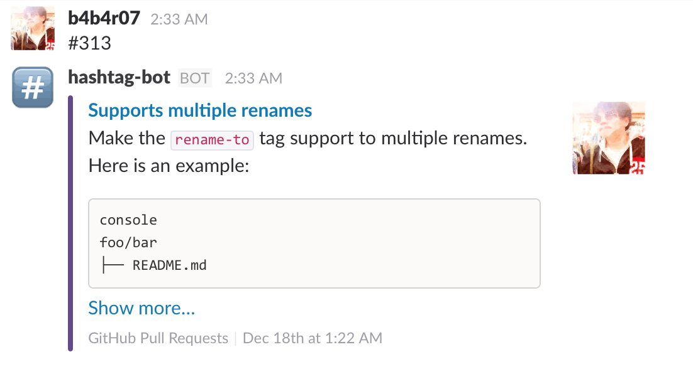

hashtag-bot
===========



# Usage

```console
$ export SLACK_TOKEN=xxx
$ export GITHUB_ACCESS_TOKEN=yyy
$ ./hashtag-bot -user=b4b4r07 -repo=enhancd
```

Type in a string containing `#nnn` in Slack.

# Installation

```console
$ go get -d github.com/b4b4r07/hashtag-bot
```

# Implementations

- <https://github.com/zplug/bots/tree/master/hashtag-bot>

# License

MIT

# Author

@b4b4r07
